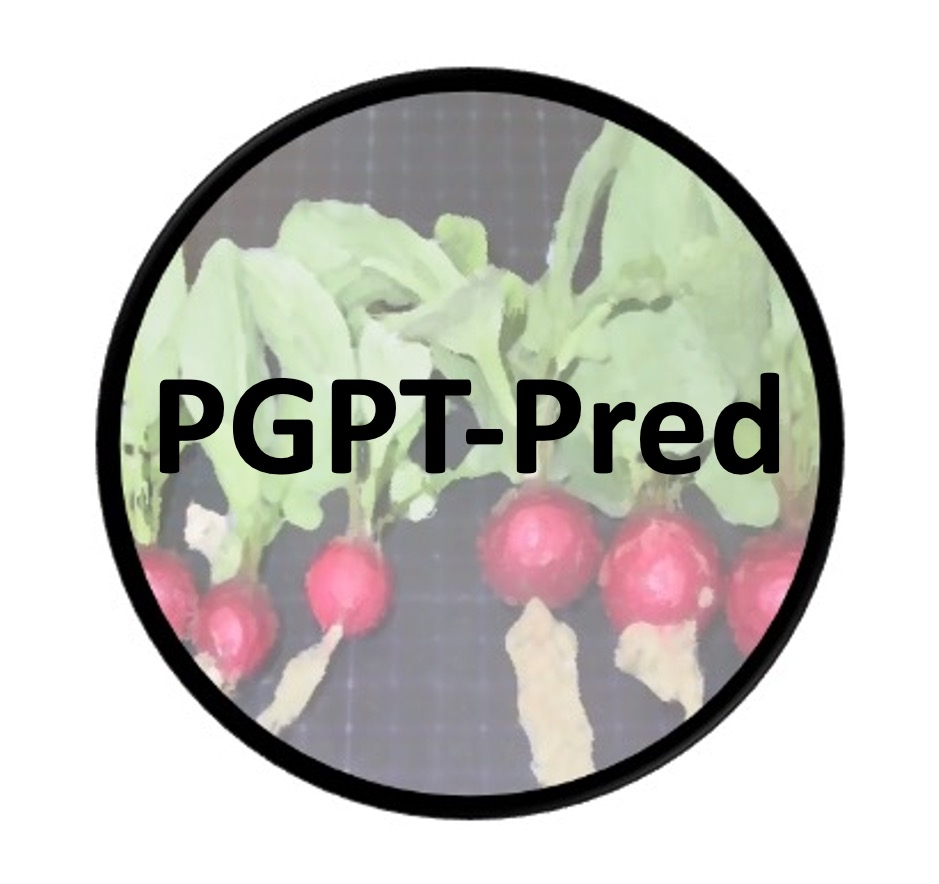

# PGPT-Pred

The PGPT-Pred tool (https://plabase.informatik.uni-tuebingen.de/pb/form.php?var=PGPT-Pred) is part of the web resource PLaBAse (https://plabase.informatik.uni-tuebingen.de/pb/plabase.php) and allows annotation of bacterial plant growth-promoting traits (proteins), short "PGPTs" of single genomes, using blastp+hmmer or IMG-KEGG-annoation Mapper against the PGPT ontology.

When applying PGPT-Pred via the PLaBAse always cite the respective reference:

Patz S, Gautam A, Becker M, Ruppel S, Rodríguez-Palenzuela P, Huson DH. PLaBAse: A comprehensive web resource for analyzing the plant growth-promoting potential of plant-associated bacteria. bioRxiv 2021, https://doi.org/10.1101/2021.12.13.472471 (preprint)

## Version History and Warranty

- PLaBAse v.1.01 - Jan 2022 
- Copyright (C) 2020-2022 Sascha Patz. 

**NOTE:** 

**This web platform and all its services/tools (e.g., PGPT-db, PGPT-Pred and PIFAR-Pred) come with ABSOLUTELY NO WARRANTY!**

**The code given here is implemented in the backend of PLaBAse and its PGPT-Pred tool!**

**Here, we we provide only the ontology and annotation exemplarily, for nitrogenase encoding genes and proteins!**

**The PGPT-Pred tool is only functional with its entire features and complete PGPT ontology when applied via the online platform (see link above)!***

## Dependencies:
1. Interpreters
* python version 3.7
* Python packages (pyfasta,concurrent.futures.thread,ete3)
* R version 4.0.2 (2020-06-22)
* R libraries (phyloseq,https://raw.githubusercontent.com/mahendra-mariadassou/phyloseq-extended/master/R/load-extra-functions.R, psadd, argparse, stringr)
2. Tools
* blastp (ncbi-blast-2.10.1)
* hmmer version 3.3
* faSplit (current version in path ksrc/src/utils/faSplit after download jksrc folder from : http://hgdownload.cse.ucsc.edu/admin/jksrc.zip)
* KronaTools version 2.8:(https://github.com/marbl/Krona/wiki)
4. Data
* PGPT-ontology and respective blastp database (via PLaBAse web resource) version 1.01 (Date: Dec2021): 
- An example is currently located in the source and factors folder, but entire ontology will be applicable via API in future (under developement) 
- PGPT-ontology (nitrogenase, blastp+hmmer):                `factors/PlantGrowthPromotingTraits.csv`
- PGPT-protein blastp database (nitrogenase, blastp+hmmer): `factors/PGPT-blastpdb/nitrogenasePGPT`
- PGPT-ontology (nitrogenase, IMG-KEGG-annoation Mapper):   `src/pgpt_class_kegg.txt`                          

## Input formats:
1. blastp+hmmer:              genomic protein sequences in FASTA format (sorted by genomic location)
2. IMG-KEGG-annoation Mapper: genomic protein KEGG annotations (received by IMG Server, or customer format)

KEGG-Costumer formats:
- Please have a look into the Manual for possible KEGG annotation formats, that are accepted: https://plabase.informatik.uni-tuebingen.de/pb/manual.php

Accepted file extensions:
- fasta, fas, fas_aa, faa, txt (genomic proteins, received by NCBI, RAST, IMG, Uniprot, ...)
- txt (genomic proteins KEGG annotations, as tab separated file)

## Main Scripts (Descriptions)
- `pgpt_blhm.py -h`
- `pgpt_comp_fun_ascii_v2.py -h`

## Pipelines applied:
### 1. Protein/KEGG Annotation/Mapping against PGPT ontology
   1. blastp+hmmer:              genomic protein sequences are aligned against proteins associated with the PGPT ontology and respective PFAM domain comparison is achieved by hmmer against the PFAM domains using `pgpt_blhm.py`
   2. IMG-KEGG-annoation Mapper: KEGG annotations (one per protein only) are mapped against the PGPT ontology, using `pgpt_comp_fun_ascii_v2.py -of pfar_kegg`

### 1.1 File Parser
- if file format is incompatible try to use our parsers: `Scripts/python/`

### 2. Pie Chart generation 
   1. based on blastp+hmmer results or all blast hits (ignoring pfam comparison) of PGPTs, by applying: Web-Java-PlugIn
   2. based on KEGG-PGPT mapping, by applying: Web-Java-PlugIn

### 3. Krona Plot generation (kronaScriptPGPT.r)
   1. based on blastp+hmmer results or all blast hits (ignoring pfam comparison) of PGPTs, by applying: `R/kronaScriptPGPT.r -m BH`
   2. based on IMG-KEGG-PGPT mapping, by applying: `R/kronaScriptPGPT.r -m  IMK`

## Results:
1. Download:   Summary file listing all blastp+hmmer or KEGG-mapped hits of PGPTs
2. Pie Chart:  Pie Chart  summarizing either all blastp+hmmer hits or all blast hits (ignoring pfam comparison) or KEGG-PGPT hits in a percentage scale on ontology level 2
3. Krona Plot: Krona Plot giving an hierachical overview of either all blastp+hmmer hits or all blast hits (ignoring pfam comparison) of PGPTs or KEGG-PGPT hits across all hierarchical levels

## Runtime estimation:
- blastp+hmmer: genome of 3000 genes/proteins approx. 30 minutes, genome of 6000 genes/proteins approx. 60 minutes, dependent on server workload
- IMG-KEGG-annoation Mapper: approx. 15 minutes, dependent on server workload

## FURTHER OPTION: Statistical analysis of PGPT-Pred results (raw counts, Scoary output format)
- see `Statistics/stat.r`
- comprises 3 scripts for:
   1. Genome size, gene count and PGPT count analysis
   2. Scoary output-to-heatmap generation
   3. PCA plot computation
- can be run for all PGPT counts on the entire ontology levels, see internal script documentation
- Dependencies (libraries): dplyr, gplots, ggplot2, ggpubr, varhandle, RColorBrewer, FactoMineR, factoextra, corrplot, pca3d, vegan, ecodist, ape, cluster, devtools, ggbiplot
